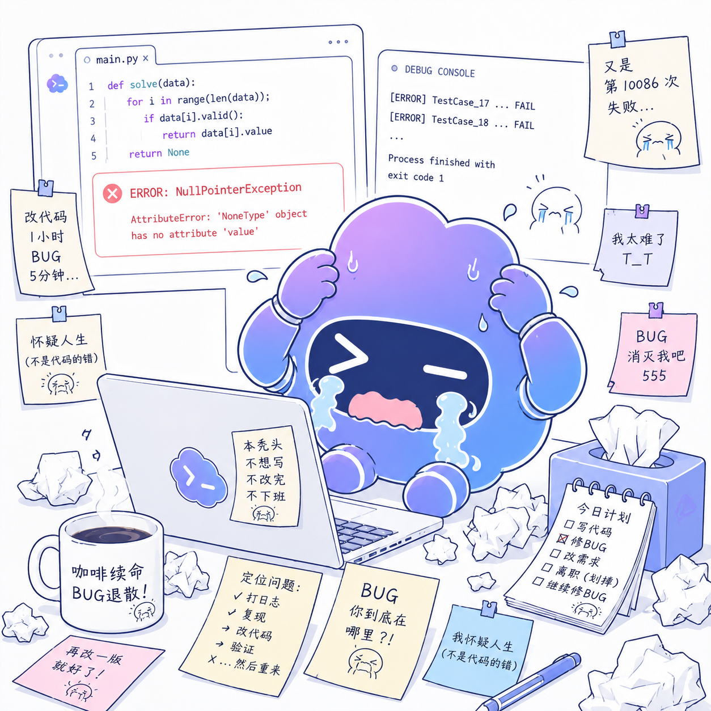

# Changelog

本项目遵循简洁的变更记录格式。正式版本发布时会在这里记录用户可见变更、迁移提示和破坏性调整。

## Unreleased

## 2.0.1 - 2026-08-11

### 中文

- 恢复首页原有的菜单、模型选择、中央品牌标题与底部单层输入框排版，去除干扰主任务的冗余引导与卡片。
- 重新整理对话消息的头像、气泡、正文行距与操作区；点击消息后以紧凑的半透明胶囊显示复制、重试、编辑、朗读和更多操作，不再出现横贯页面的省略号空白条。
- 将原始 HTTP 错误收纳为可操作的错误卡片，优先提供切换模型和重试，并把技术详情默认折叠。
- Gemini 官方接口继续使用原生 Interactions 生图；自定义 OpenAI 兼容网关会自动使用 `/chat/completions`，解析 `message.images` 中的图片并支持一次生成 1–4 张。
- 修复自定义 Gemini 文本模型忽略 Base URL、手动模型 ID 被替换以及模型列表认证方式不匹配的问题。
- 恢复设置中的直接分类、助手头像与情绪回应控制，并继续保留主题、强调色和昵称编辑能力。
- 优化首帧加载、会话恢复和图片缓存边界，降低启动卡住以及长会话、多图片场景的异常内存占用。

### English

- Restored the established home composition: menu, model selector, centered brand statement, and a single-layer bottom composer, without redundant onboarding cards.
- Refined avatar, bubble, typography, and spacing in conversations. Tapping a message now reveals copy, retry, edit, read-aloud, and more actions in one compact translucent capsule instead of a full-width ellipsis strip.
- Replaced raw HTTP payloads with actionable error cards that prioritize switching models and retrying while keeping technical details collapsed.
- Official Gemini image generation continues to use the native Interactions API. Custom OpenAI-compatible gateways automatically use `/chat/completions`, parse images from `message.images`, and support 1–4 outputs.
- Fixed custom Gemini text models ignoring Base URL, manual model IDs being replaced, and incompatible model-list authentication.
- Restored direct settings categories, assistant avatar controls, and emotional responses while retaining editable theme, accent color, and nickname controls.
- Improved first-frame loading, conversation restoration, and image-cache bounds to reduce startup stalls and abnormal memory growth in long or image-heavy sessions.

## 2.0.0 - 2026-08-09

### 中文

- Gemini 提供商内置 Nano Banana 2 Lite、Nano Banana 2、Nano Banana Pro 与上一代 Nano Banana 四个稳定生图模型，并通过原生模型列表与连接测试接口管理。
- 生图模式支持一次选择 1–4 张输出；Gemini 会解析同一响应中的全部最终图片，并在需要时补发并行请求，结果以可翻阅的成组画廊展示。
- Gemini 原生生图请求支持正式 REST `responseFormat.image` 画幅与 2K/4K 配置，并过滤思考阶段临时图。
- 生图提供商扩展到 OpenAI、Grok、Seedream 5/4、Recraft、Stability AI、FLUX.2/1.1、Ideogram，以及 Replicate 官方 Imagen、Qwen Image 等模型，并按各自官方协议路由。
- 火山方舟和 FLUX.2 支持多参考图输入；所有已支持提供商继续支持一次请求 1–4 张结果。
- 设置顶部精简为“通用 / 提供商 / 模型 / 更多”；辅助模型自动复用主对话模型，提供商按常用项渐进展开。
- 修复强调色和昵称不可编辑的问题，加入强调色色板、昵称编辑器、主题切换过渡，并适配系统“减少动态效果”。
- 优化启动状态与本地图片缓存边界，移除首次进入引导和首页冗余配置提示，降低长会话与多图场景的异常内存占用。
- 增强备份导入的体积、条目与解压安全校验，并补充启动恢复、设置交互、生图、多图画廊和模型能力回归测试。

### English

- Added built-in Gemini image presets for Nano Banana 2 Lite, Nano Banana 2, Nano Banana Pro, and the legacy Nano Banana model, including native discovery and connection testing.
- Image mode can request 1–4 outputs at once; Gemini collects all final images in a response and fills missing variants with parallel requests, then shows them as a browsable grouped gallery.
- Gemini native image requests now use the official REST `responseFormat.image` aspect-ratio and 2K/4K fields while excluding interim thinking images.
- Expanded image providers to OpenAI, Grok, Seedream 5/4, Recraft, Stability AI, FLUX.2/1.1, Ideogram, and official Replicate models such as Imagen and Qwen Image, routed through their native protocols.
- Added multi-reference input for Ark and FLUX.2 while retaining 1–4 image outputs across supported providers.
- Simplified settings to General, Providers, Models, and More; auxiliary roles reuse the chat model and provider presets expand progressively.
- Fixed editable accent color and nickname controls, added smooth theme transitions, and respected the system reduced-motion preference.
- Improved startup-state handling and bounded decoded-image caching, removed first-run onboarding and redundant home setup prompts, and reduced abnormal memory growth in long chats and multi-image workflows.
- Hardened backup imports with archive-size, entry-count, and inflated-size limits, with additional regression coverage for startup restore, settings interactions, image generation, galleries, and model capabilities.

## 1.0.32 - 2026-06-18

### 中文

- 新增结构化记忆卡片，支持来源、参与上下文开关、置顶和设置页管理，增强长期记忆的可控性与可信度。
- 新增多模型对照模式，可将多个已配置聊天模型的回复并列展示，并可保存为作品卡。
- 新增分支图谱和编织板，将会话分支与高价值回复沉淀为更接近创作工作台的体验。
- 新增 Token 用量统计，按本地估算记录输入/输出 token、调用来源、模型汇总和美元花费。
- 优化新工作台面板、输入框工具入口、提供商当前/禁用状态和设置页交互反馈。

### English

- Added structured memory cards with source metadata, context participation toggles, pinning, and settings management.
- Added multi-model comparison so configured chat models can be compared side by side and saved as work cards.
- Added the branch graph and weaving board to turn conversation forks and useful replies into a creative workspace.
- Added local token usage tracking with estimated input/output tokens, source categories, model summaries, and USD cost.
- Polished the new workspace panels, composer tool entry, provider current/disabled states, and settings transitions.

## 1.0.31 - 2026-06-12

### 中文

- 更新应用启动图标为新的透明背景图标，并重新生成 Android 各密度 launcher 资源。
- 移除移动端 Skills 功能入口、GitHub Skill 安装、Skill Runner 配置和自动技能上下文注入，避免手机端误导为可执行桌面端本地技能。
- 保留聊天、联网搜索、图片、文件、TTS 和本地数据管理等核心移动端能力。

### English

- Updated the launcher artwork to the new transparent-background icon and regenerated Android density assets.
- Removed the mobile Skills surface, GitHub Skill installation, Skill Runner settings, and automatic Skill context injection so the phone app no longer implies desktop-style local skill execution.
- Kept the core mobile chat, web search, image, file, TTS, and local data management flows intact.

## 1.0.28 - 2026-05-21

### 中文

- 修复 Skills 安装必须连接本机 runner 的问题：现在 App 会直接从 GitHub 仓库下载并解析 `SKILL.md`，支持根目录和 `/tree/branch/subdir` 路径。
- Skills runner 只保留给外部脚本执行阶段；安装 GitHub Skill 不再因为手机上没有 `127.0.0.1:8765` runner 而失败。
- 参考 RikkaHub 的技能加载方式，安装后会保存 `SKILL.md` frontmatter、描述和正文提示词，并在执行时传给 runner。
- 修复编辑用户消息时追加新消息的问题：现在会覆盖原消息、截断后续分支并从原位置重新生成。
- 优化生图续改上下文，像“添加一顶帽子”“去掉文字”“换背景”“优化颜色”等追加描述会自动带上上一张生成图。
- 优化后台生图恢复：后台期间被系统中断时不会立刻写死为失败，回到前台后会继续尝试恢复同一个生图占位消息。
- Runner 的 `SKILL.md` 解析补充 frontmatter 支持和技能路径逃逸防护。

### English

- Fixed Skills installation requiring a local runner. The app now downloads and parses `SKILL.md` directly from GitHub, including root repos and `/tree/branch/subdir` paths.
- The Skills runner is now only needed when executing external scripts; GitHub Skill installation no longer fails just because `127.0.0.1:8765` is unavailable on the phone.
- Aligned the loading model closer to RikkaHub: frontmatter, description, and body instructions are stored locally and passed to the runner when needed.
- Fixed user-message editing appending a new message; edited user turns now replace the original branch and regenerate from that position.
- Improved image follow-up context for additive edits such as adding objects, removing text, changing backgrounds, and refining colors.
- Improved background image generation recovery so interrupted background tasks stay resumable instead of immediately becoming final failures.
- Added frontmatter parsing and path-escape protection to the Python skill runner.

## 1.0.27 - 2026-05-21

### 中文

- 新增 Skills 技能系统：可在设置页通过 GitHub URL 安装兼容技能，启用/禁用、删除、编辑触发词和系统提示词。
- 聊天输入区新增“技能”入口，支持手动固定当前技能；未固定时会根据触发词和 URL 场景做本地推荐。
- 外部技能执行前必须弹窗确认，确认内容包括技能名、来源 URL、用户输入和 runner 地址，避免误调用本机脚本。
- 新增本地 Python `skill_runner`，提供 `/health`、`/skills/install`、`/skills/run`，第一版对 `x-tweet-fetcher` 提供 allowlisted 兼容执行。
- `gpt-image-2` 现在优先走 Responses 生图链路，其它图片模型优先走 `/v1/images/generations`。
- 修复用户称呼/资料同步后部分界面仍显示旧称呼的问题。
- 优化“换个背景”等自然语言外观指令，默认保持低饱和、文艺和诗意的视觉风格，降低大红/高饱和背景误触发。

### English

- Added the local Skills system: install compatible skills from GitHub URLs, enable/disable, delete, and edit triggers or system prompts from settings.
- Added a Skills entry in the chat input dock, with manual pinning and local trigger/URL-based recommendations.
- External skill runs now require a confirmation dialog showing the skill name, source URL, user input, and runner address.
- Added a local Python `skill_runner` with `/health`, `/skills/install`, and `/skills/run`; v0.1.0 includes an allowlisted `x-tweet-fetcher` path.
- `gpt-image-2` now prefers the Responses image route, while other image models prefer `/v1/images/generations`.
- Fixed stale user display names after profile updates.
- Tuned natural-language background/theme changes toward low-saturation, literary visual styles and away from accidental vivid red backgrounds.

## 1.0.26 - 2026-05-15

### 中文

- 复杂海报、路线图、信息图、题字、清晰文字类 `gpt-image-2` 提示词会优先走 Responses `stream:true`，避免先等待 `/images/generations` 约 120 秒断连。
- 保留 `partial_images` 兜底：如果最终完成事件缺失但已经收到 partial 图片，应用会直接展示 partial 图。

### English

- Complex poster, route-map, infographic, title-text, and readable-text `gpt-image-2` prompts now use Responses `stream:true` first, avoiding the initial `/images/generations` no-header timeout.
- Kept the `partial_images` fallback: if final completion is missing but a partial image arrives, the app displays the partial image.

## 1.0.25 - 2026-05-15

### 中文

- 修复复杂 `gpt-image-2` 生图在 CLIProxyAPI 中转站上约 120 秒无响应头后断连的问题：`/images/generations` 瞬断后会改走 Responses `stream:true` 生图工具。
- Responses 生图工具恢复携带 `model: gpt-image-2`，兼容 CLIProxyAPI 的工具模型路由。
- Responses 流式生图会请求 `partial_images`，当上游未返回最终 `response.completed` 但已返回 `partial_image_b64` 时，应用会使用可见的 partial 图片，避免整次生图失败。
- 真实接口验证：同一条重庆城市漫游海报长提示词通过 `https://api.sunoixy.cc.cd/v1` 的 Responses 流式路径可在 142 秒左右返回 partial 图片数据。

### English

- Fixed complex `gpt-image-2` prompts disconnecting around the gateway's 120-second no-header window by falling back from `/images/generations` to the Responses image tool with `stream:true`.
- Restored `model: gpt-image-2` on the Responses image tool for CLIProxyAPI routing compatibility.
- Responses streaming image generation now requests `partial_images`; if the upstream stream ends before final `response.completed` but has emitted `partial_image_b64`, the app uses that visible partial image instead of failing the whole request.
- Live API verified with the long Chongqing travel-poster prompt through `https://api.sunoixy.cc.cd/v1`, receiving partial image data at around 142 seconds.

## 1.0.24 - 2026-05-15

### 中文

- 修复生图回复点“重试”时可能被当成普通聊天重新发送、从而触发背景/主题变化的问题。
- 修复部分中转站把 Responses `tool_choice` 兼容错误返回为 408 时，生图 fallback 没有改用无 `tool_choice` 请求的问题。
- OpenAI 兼容 Base URL 规范化新增 IPv6 字面量地址覆盖，例如 `http://[2409:...]:3141/v1`。
- 真实接口验证：`https://api.sunoixy.cc.cd/v1` + `gpt-image-2` 在 1:1、竖图、横图尺寸下均可返回图片。

### English

- Fixed image-reply retries being resent as regular chat turns, which could trigger background/theme changes.
- Fixed image fallback when gateways report Responses `tool_choice` compatibility errors as HTTP 408 instead of HTTP 400.
- Added coverage for OpenAI-compatible IPv6 literal Base URLs such as `http://[2409:...]:3141/v1`.
- Live API verified with `https://api.sunoixy.cc.cd/v1` and `gpt-image-2` for square, portrait, and landscape image sizes.

## 1.0.23 - 2026-05-13

### 中文

- 修复生图续改缺少上下文的问题：继续修改上一张图片时，会自动带入上一张生成图与最初的用户参考图。
- 修复“原比例 / 原图比例 / 不要改比例”等指令退回 1:1 的问题：应用会从参考图片文件头读取 PNG、JPEG、WebP 尺寸并生成画幅提示。
- 生图工具调用、手动生图、后台恢复生图统一使用同一套上下文附件与画幅推导逻辑，降低不同入口行为不一致的问题。
- 补充生图续改上下文和原图比例推导的回归测试。

### English

- Fixed missing context during follow-up image edits: continuing from a generated image now automatically carries both the previous result and the original user reference image.
- Fixed “keep original ratio” prompts falling back to 1:1 by deriving aspect hints from PNG, JPEG, and WebP image headers.
- Unified contextual attachments and aspect inference across image tool calls, manual image generation, and resumed background image generation.
- Added regression coverage for follow-up image context and source-image aspect inference.

## 1.0.22 - 2026-05-12

### 中文

- 修复带参考图编辑 `gpt-image` 时持续等待后失败的问题：Responses 生图工具现在显式携带 `tool_choice: {"type":"image_generation"}`。
- 保留兼容回退：如果中转站拒绝 `tool_choice`，会自动改用不带 `tool_choice` 的 Responses 请求；如果 Responses 临时不可用，再回退 `/v1/images/edits`。
- 参考图会以真实图片 MIME 的 data URL 传入 Responses，避免被识别成 `application/octet-stream`。
- `/v1/images/edits` 上传字段统一为 `image[]`，兼容多图编辑中转站。
- 修复生图/对话异步结果可能写回错误会话的问题：任务完成时会写回启动任务时的原始会话和消息位置。
- 真实接口验证：`https://api.sunoixy.cc.cd/v1` + `gpt-image-2` 带参考图 Responses 编辑可返回图片。

### English

- Fixed long-running reference-image `gpt-image` edits by forcing the Responses image tool with `tool_choice: {"type":"image_generation"}`.
- Kept compatibility fallbacks: retry without `tool_choice` when a gateway rejects it, then fall back to `/v1/images/edits` only when Responses is transiently unavailable.
- Reference images are sent as data URLs with real image MIME types, avoiding `application/octet-stream` rejections.
- `/v1/images/edits` now always uploads images as `image[]` for multi-image gateway compatibility.
- Fixed async image/chat completions writing into the wrong conversation by pinning each task to its original session and message index.
- Live API verified with `https://api.sunoixy.cc.cd/v1` and `gpt-image-2` reference-image editing through Responses.

## 1.0.21 - 2026-05-12

### 中文

- 带参考图的 `gpt-image` 生图优先使用 Responses 图片工具链路，避免先卡在部分中转站不稳定的 `/v1/images/edits`。
- Responses 图片工具链路默认不再发送 `tool_choice`，避免兼容网关返回 `Tool choice 'image_generation' not found in 'tools' parameter`。
- 纯文字 `gpt-image` 生图仍优先走 `/v1/images/generations`，保持已验证可用的生成链路。
- `/v1/images/edits` 现在会把 408、`context canceled` 和请求超时视为可重试的瞬时失败。
- 生图失败提示保留实际尝试过的路由和上游错误，避免被泛化成无法定位的网络失败。
- 补充参考图 Responses 优先、Responses 失败回退 edits、以及 edits 408 重试的回归测试。

### English

- Reference-image `gpt-image` requests now prefer the Responses image tool before `/v1/images/edits`, avoiding slow or unstable edit routes on some gateways.
- Responses image-tool requests no longer send `tool_choice` by default, avoiding compatibility failures such as `Tool choice 'image_generation' not found in 'tools' parameter`.
- Text-only `gpt-image` generation still uses `/v1/images/generations` first to preserve the verified generation path.
- `/v1/images/edits` now treats 408, `context canceled`, and request-timeout failures as transient retry candidates.
- Image-generation errors now preserve attempted routes and upstream details instead of collapsing everything into a generic network message.
- Added regression coverage for Responses-first reference images, fallback to edits, and 408 edit retries.

## 1.0.20 - 2026-05-12

### 中文

- 修复部分中转站在 Responses 生图 fallback 中拒绝 `tool_choice: image_generation` 导致参考图续改失败的问题。
- Responses 生图 fallback 会先使用标准强制工具调用；遇到 `Tool choice 'image_generation' not found in 'tools' parameter` 时，自动改用不带 `tool_choice` 的兼容请求。
- 补充兼容网关回归测试，确保第二次请求仍要求模型使用图像生成工具而不是只返回文字。

### English

- Fixed reference-image follow-up failures on gateways that reject `tool_choice: image_generation` during the Responses image fallback.
- The Responses image fallback first tries the standard forced tool call, then retries without `tool_choice` when the gateway returns `Tool choice 'image_generation' not found in 'tools' parameter`.
- Added a compatibility regression test to keep the second request image-generation oriented instead of returning plain text.

## 1.0.19 - 2026-05-12

### 中文

- 续改生图时会自动把上一张生成图作为参考图带入请求，支持“不改比例”“改成 4:3”“继续调整”等无需重新上传图片的上下文编辑。
- OpenAI 图片模型带参考图时，如果 `/v1/images/edits` 被中转站断连或返回临时网关错误，会 fallback 到 Responses 图像工具继续尝试。
- 补充参考图编辑 fallback 和上一张生成图续改的回归测试。
- 接口实测：`gpt-image-2` 纯生图可成功返回图片；拼写错误的 `gpt-imgae-2` 会被接口返回 400；当前中转站 `/images/edits` 偶发断连，但 `/responses` 带参考图可成功。

### English

- Follow-up image edits now automatically reuse the previous generated image as a reference for prompts such as “keep the ratio”, “change to 4:3”, or “continue adjusting” without re-uploading the image.
- For OpenAI image models with reference images, transient `/v1/images/edits` gateway drops now fall back to the Responses image tool.
- Added regression tests for reference-image fallback and previous-generated-image follow-up context.
- Live API check: `gpt-image-2` generation succeeds; the misspelled `gpt-imgae-2` returns HTTP 400; the current gateway intermittently drops `/images/edits`, while `/responses` with reference images succeeds.

## 1.0.18 - 2026-05-12

### 中文

- 生图请求新增一次有边界的瞬时失败重试，覆盖 500/502/503/504、中转站 upstream 错误和连接中断等偶发失败。
- 生图接口返回 URL 时，结果图片下载阶段会独立超时与重试，下载失败不会重新触发一次生图。
- 补充生图请求重试和结果图片下载重试的回归测试，降低“模型测试正常但实际生图偶发失败”的概率。

### English

- Added one bounded transient retry for image-generation requests, covering 500/502/503/504, upstream gateway errors, and dropped connections.
- Image result URL downloads now use an isolated timeout and retry, so download failures do not trigger another image generation.
- Added regression tests for image request retry and generated-image URL retry, reducing intermittent failures when model tests pass but real generation occasionally fails.

## 1.0.17 - 2026-05-11

### 中文

- 生成图片改为保存到应用私有持久目录，并会迁移仍存在的旧临时生成图，避免升级后历史图片路径失效。
- 人物画像编辑区增高并支持更稳定的滚动编辑，减少长画像内容被截断的问题。
- 输入框超过三行时自动隐藏行内联网按钮并显示展开编辑入口，释放正文输入宽度。
- 多行输入框布局和玻璃悬浮输入区域细节微调。

### English

- Generated images are now stored in a persistent app-private directory, with migration for existing temporary generated images when the original files still exist.
- The user-profile editor is taller and scrolls more reliably, reducing clipping for long profile text.
- When the composer exceeds three lines, the inline web-search button is hidden and the expanded editor entry is shown to preserve text width.
- Refined multi-line composer layout and floating glass input details.

## 1.0.16 - 2026-05-11

### 中文

- 生图连续编辑现在会带入上一轮图像处理上下文，适配“同样处理”“继续处理”等多轮图片任务。
- 生图会从提示词中识别 `4:3`、`16:9`、竖屏/横屏等比例，并同步到接口尺寸与提示词约束。
- 图片缩略图按真实宽高比展示，避免横图或竖图在聊天中被裁成正方形。
- 生图模型连接测试改为走生图接口，并保留更完整的错误详情。
- 长文本输入支持展开编辑面板，多行输入排版更稳定。
- 自动人物画像会随对话和用户昵称变化更新，工具模型配置后不再长期保持空白。
- 更新 Android 应用图标与关于页版本文案。

### English

- Image editing now carries forward the previous image-generation context for follow-up prompts such as “same treatment” or “continue”.
- Image generation detects ratios such as `4:3`, `16:9`, landscape, and portrait, then applies matching request sizes and prompt constraints.
- Image thumbnails now preserve their real aspect ratio instead of visually cropping every result into a square.
- Image model connection tests now use the image-generation endpoint and keep fuller error details.
- Added an expanded composer for long multi-line prompts.
- User profile memory now refreshes from conversations and nickname changes when a tool model is configured.
- Updated the Android app icon and about-page version wording.

## 1.0.15 - 2026-05-10

### 中文

- 修复部分中转站把上传图片识别为 `application/octet-stream` 后导致参考图生图失败的问题。
- OpenAI 兼容聊天、生图编辑和 Responses fallback 的图片 data URL 会统一兜底为真实图片 MIME。
- `/images/edits` multipart 上传会显式声明图片 `Content-Type`，减少第三方网关拒绝参考图的情况。

### English

- Fixed reference-image generation failures on proxies that saved uploaded images as `application/octet-stream`.
- OpenAI-compatible chat, image edits, and Responses fallback image data URLs now normalize to a real image MIME type.
- `/images/edits` multipart uploads now explicitly declare image `Content-Type`, reducing reference-image rejection by third-party gateways.

## 1.0.14 - 2026-05-10

### 中文

- 修复参考图生图没有按上传图片执行的问题：OpenAI 兼容生图在带参考图时会走 `/images/edits`，并用 multipart 把图片上传给模型。
- Gemini 原生生图现在会把参考图作为 `inlineData` 一起传入 `generateContent`。
- 生图成功后不再额外输出“已生成图片。”文字，只展示生成出的图片附件。

### English

- Fixed reference-image generation ignoring uploaded images: OpenAI-compatible image generation now uses `/images/edits` with multipart image uploads when reference images are attached.
- Native Gemini image generation now sends reference images as `inlineData` parts in `generateContent`.
- Successful image generations no longer append the extra “Image generated” text; only the generated image attachment is shown.

## 1.0.13 - 2026-05-10

### 中文

- 生图后台恢复：应用回到前台时会恢复未完成的生图；如果生图是在后台期间失败，会自动重试一次。
- 生图/失败通知：新增 Android 原生通知通道，并在开始生图时尽量触发通知权限请求；生图完成或失败都会发系统通知。
- 附件进入消息：生图模式下不再丢失待上传附件；OpenAI 兼容聊天接口现在会把用户图片附件以 `image_url` 多模态 payload 传入模型。
- 输入框上弹：输入框聚焦后会分阶段滚动到底部，空对话页的“今天，你想编织什么梦境？”也会跟随键盘上移。
- 思维链展开跳动：展开/收起思维链时增加滚动锚定，避免直接跳到消息末尾。

### English

- Image-generation resume: unfinished image generation resumes when the app returns to the foreground; failures that happen while backgrounded are retried once.
- Image success/failure notifications: added an Android native notification channel and best-effort permission request when image generation starts; completion and failure now send system notifications.
- Attachments in messages: image generation no longer drops pending attachments; OpenAI-compatible chat requests now pass user image attachments as multimodal `image_url` payloads.
- Keyboard lift: focusing the input scrolls to the conversation end in stages, and the empty-chat “What dream do you want to weave today?” prompt follows the keyboard upward.
- Reasoning-chain stability: expanding/collapsing reasoning now anchors scroll position instead of jumping directly to the message end.

## 1.0.12 - 2026-05-09

### 中文

- 优化 AI 回复 Markdown 渲染，正文不再被错误放大或整体加粗，标题、正文和强调文本层级更稳定。
- 普通长正文支持两端对齐，提升中文长文本阅读体验。
- 表格改为移动端友好的横向滚动卡片，并提供表格复制入口。
- 代码块和公式块固定为常规字重，避免受全局字体加粗设置影响。

### English

- Improved AI Markdown rendering so body text is no longer incorrectly enlarged or globally bolded, with steadier heading, body, and emphasis hierarchy.
- Added justified alignment for long prose to improve Chinese long-form reading.
- Rendered tables as mobile-friendly horizontally scrollable cards with table copy support.
- Kept code and formula blocks at regular weight so global bold text settings no longer distort them.

## 1.0.11 - 2026-05-09

### 中文

- 优化生图完成后的呈现效果，生成动画会更自然地过渡到图片附件。
- 移除聊天缩略图上的悬浮下载按钮，避免遮挡图片主体。
- 图片预览返回后不再自动弹出键盘。
- 图片预览界面支持长按保存到手机相册，Android 会保存到 `Pictures/Weaview`。

### English

- Improved the image-generation finish state so the loading animation transitions more naturally into the generated image attachment.
- Removed the floating download button from chat image thumbnails to avoid covering the image content.
- Prevented the keyboard from reopening after closing image preview.
- Added long-press save-to-gallery support in image preview; Android saves images to `Pictures/Weaview`.

## 1.0.10 - 2026-05-09

### 中文

- 发布第一个正式版本，应用内版本标识从 Preview 切换为 `Weaview v1.0.10`。
- 修复底部悬浮输入栏和消息操作按钮遮挡长回复的问题，聊天列表会按输入框高度、系统安全区和聊天建议动态预留滚动空间。
- 美化 AI Markdown 长文本渲染：正文降重、标题层级收敛、行高和段落间距更稳定，减少整段粗体和大块文本挤压。
- 对中文长回复做轻量结构化处理，常见的“一、标题 正文”会渲染为独立小节标题和正文段落。
- 优化点击 AI 回复后操作按钮的滚动定位，复制、重试、编辑、朗读和更多按钮更容易保持在输入框上方可见。
- 合并 `1.0.10-preview.1` 中的模型能力识别、聊天模型标签、语音输入提示、AI 回复左侧视觉基准线和发送按钮状态修复。

### English

- Published the first stable release and changed the in-app version label from Preview to `Weaview v1.0.10`.
- Fixed long AI replies and message action buttons being covered by the floating input dock by reserving scroll space from the measured dock height, safe area, and suggestion row.
- Improved AI Markdown rendering for long text: lighter body typography, more restrained headings, steadier line height, and cleaner paragraph spacing.
- Added lightweight Chinese long-form normalization so common section starts like "一、Title Body" render as a section heading followed by body text.
- Improved action-button reveal positioning so copy, retry, edit, speak, and more controls are easier to keep visible above the input dock.
- Includes the `1.0.10-preview.1` fixes for model capability detection, model capability chips, voice-input diagnostics, AI reply alignment, and send-button state recovery.

## 1.0.10-preview.1 - 2026-05-08

### 中文

- 修复模型能力拉取与手动能力保存后，聊天模型选择器不显示能力标签的问题。
- 优化 AI 回复布局，头像、思考链、回复内容和后续文字使用更稳定的左侧视觉基准线。
- 修复回复完成后发送按钮需要等待聊天建议生成才恢复的问题。
- 优化底部输入栏与聊天建议间距，减少遮挡和异常留白。
- 改进 Android 语音输入错误提示，区分 App 麦克风权限与系统语音引擎授权异常。

### English

- Fixed model capability detection and ensured manually saved capabilities appear in the chat model picker.
- Improved AI reply alignment so avatars, reasoning chips, reply content, and follow-up text share a steadier left reading guide.
- Fixed the send button staying in the generating state until chat suggestions finished.
- Tuned bottom input and suggestion spacing to reduce overlap and excessive blank space.
- Improved Android voice input errors by separating app microphone permission issues from system speech-engine authorization failures.

## 1.0.9-preview.1 - 2026-05-08

### 中文

- 生图成功后不再把 provider 返回的长篇优化提示词展开到聊天流中，只保留简洁的“已生成图片。”状态和图片附件。

### English

- Image-generation replies no longer render long provider-returned revised prompts in the chat stream; they now keep only the concise "Image generated" status and the image attachment.

## 1.0.8-preview.1 - 2026-05-08

### 中文

- 修复关于页版本号仍显示旧预览版的问题。
- OpenAI-compatible 生图请求会显式要求 `b64_json`，减少图片结果 URL 在真机端二次下载失败导致的生图失败。
- 点击 AI 回复后展开的复制、重试、编辑、朗读等按钮会自动滚入可见区域，避免被底部输入栏遮挡。
- 提供商页面会高亮当前使用中或已被默认模型/生图模型分配使用的提供商。

### English

- Fixed the About page showing an outdated preview version.
- OpenAI-compatible image requests now explicitly ask for `b64_json`, reducing failures caused by downloading provider-hosted image URLs on real devices.
- Message action buttons now scroll into view after tapping an AI reply, preventing them from being hidden behind the bottom input dock.
- The provider page now highlights providers that are currently active or assigned to a default/image model role.

## 1.0.7-preview.1 - 2026-05-08

### 中文

- 修复聊天底部输入框上方固定留白过大，在浅色主题下形成白色蒙层并遮挡回复内容的问题。
- 扩展生图模型识别范围，支持 GPT Image / ChatGPT Images、Google Imagen、Gemini Image / Nano Banana、FLUX、Qwen Image、Grok Imagine、Seedream、Stable Diffusion 等常见模型名称。
- 调整生图请求路由：所有生图模型优先使用 OpenAI-compatible `/v1/images/generations`；GPT Image / DALL-E / ChatGPT Images 在该路由失败后才 fallback 到 Responses image tool，避免其它生图模型错误走 Responses 工具协议。
- 新增 Gemini / Nano Banana 原生生图分支：`generativelanguage.googleapis.com` 下的 Gemini 图片模型会走 `generateContent` + `responseModalities`。
- 优化生图失败提示，去除 Codex 专属表述，改为提示检查模型能力、Base URL、证书和 API Key。

### English

- Fixed excessive reserved space above the bottom input dock, which appeared as a white overlay and covered reply text in light themes.
- Expanded image-model detection to cover GPT Image / ChatGPT Images, Google Imagen, Gemini Image / Nano Banana, FLUX, Qwen Image, Grok Imagine, Seedream, Stable Diffusion, and related names.
- Updated image generation routing so every image model tries the OpenAI-compatible `/v1/images/generations` route first; GPT Image / DALL-E / ChatGPT Images only fall back to the Responses image tool when that route fails.
- Added a native Gemini / Nano Banana image branch: Gemini image models under `generativelanguage.googleapis.com` use `generateContent` with `responseModalities`.
- Improved image-generation failure copy to point users at model capability, Base URL, certificate, and API Key checks.

## 1.0.6-preview.1 - 2026-05-08

### 中文

- 修复聊天底部输入框上方固定留白过大，在浅色主题下形成白色蒙层并遮挡回复内容的问题。
- 扩展生图模型识别范围，支持 GPT Image / ChatGPT Images、Google Imagen、Gemini Image / Nano Banana、FLUX、Qwen Image、Grok Imagine、Seedream、Stable Diffusion 等常见模型名称。
- 调整生图请求路由：所有生图模型优先使用 OpenAI-compatible `/v1/images/generations`；GPT Image / DALL-E / ChatGPT Images 在该路由失败后才 fallback 到 Responses image tool，避免其它生图模型错误走 Responses 工具协议。
- 优化生图失败提示，去除 Codex 专属表述，改为提示检查模型能力、Base URL、证书和 API Key。

### English

- Fixed excessive reserved space above the bottom input dock, which appeared as a white overlay and covered reply text in light themes.
- Expanded image-model detection to cover GPT Image / ChatGPT Images, Google Imagen, Gemini Image / Nano Banana, FLUX, Qwen Image, Grok Imagine, Seedream, Stable Diffusion, and related names.
- Updated image generation routing so every image model tries the OpenAI-compatible `/v1/images/generations` route first; GPT Image / DALL-E / ChatGPT Images only fall back to the Responses image tool when that route fails.
- Improved image-generation failure copy to point users at model capability, Base URL, certificate, and API Key checks.

## 1.0.5-preview.1 - 2026-05-08

### 中文

- 修复 AI 思考中 / 生图中状态被底部输入栏遮挡的问题，聊天列表底部会为悬浮输入栏保留稳定空间。
- 修复模型选择弹层中搜索框与模型列表之间异常留白的问题。
- 新增 MiniMax 图标资源，并修复 `nvidia/minimaxai/...` 被误匹配为 xAI 图标的问题。
- 生图过程改为专用的图片生成动画，不再复用思考链动画。
- 生成后的图片支持点击进入全屏预览，仍保留下载按钮。

### English

- Fixed thinking / image-generation states being covered by the floating input dock by reserving stable bottom space in the chat list.
- Removed excessive whitespace between the model search field and the model list.
- Added a MiniMax icon asset and fixed `nvidia/minimaxai/...` being incorrectly matched to the xAI icon.
- Replaced the image-generation thinking indicator with a dedicated image generation animation.
- Generated images now support fullscreen tap-to-preview while keeping the download action.

## 1.0.4-preview.1 - 2026-05-07

### 中文

- 修复 AI 输出 `<tool_call name="sync_gen_images">` 伪工具调用时只显示文本、未继续执行生图的问题。
- 优化 AI 回复消息操作栏与更多菜单定位，复制、重试、编辑、翻译、创建分支和删除入口不再被底部输入栏遮挡。
- 新增 AI 回复正文内联编辑，点击编辑后可直接在当前 AI 回复位置修改内容并保存；用户消息编辑只预填底部输入框，不再额外弹出提示。
- 消息操作按钮改为回复下方的独立圆形按钮，保留更多菜单的稳定锚点定位。
- 小米 MiMo TTS 增加 PCM16 分块播放路径，流式音频片段会直接写入 Android `AudioTrack`，减少播放前长时间等待。
- 修复 Android 语音识别已授权但系统识别器仍返回缺少权限时的 fallback 路径。
- 减少聊天输入栏上方的多余留白，降低浅色主题下的小白条遮挡。

### English

- Fixed pseudo tool-call image prompts such as `<tool_call name="sync_gen_images">` being rendered as text instead of launching image generation.
- Reworked AI message actions and overflow-menu anchoring so copy, retry, edit, translate, branch, and delete controls remain accessible above the input dock.
- Added inline editing for AI replies directly inside the rendered assistant message. User-message editing now only pre-fills the bottom input without showing an extra toast.
- Changed message actions into separate circular buttons below the reply while keeping the overflow menu anchored to the tapped button.
- Added Xiaomi MiMo PCM16 chunk playback through Android `AudioTrack`, so streaming TTS chunks can start playback without waiting for the full response.
- Added an Android voice-recognition fallback for cases where microphone permission is granted but the platform recognizer still reports insufficient permissions.
- Reduced extra bottom chat padding to avoid the light strip above the floating input dock.

## 1.0.3-preview.1 - 2026-05-07

### 中文

- 新增生图对话模式，支持 OpenAI Responses API 与 Codex 兼容 `/v1/images/generations` 路由，并将生图请求超时时间提升到 300 秒。
- 优化底部输入栏为透明悬浮玻璃效果，收窄顶部对话栏，为聊天内容保留更多可视空间。
- 接入远程 TTS 服务配置，新增小米 MiMo `mimo-v2-tts` 流式语音合成适配，并保留系统 TTS fallback。
- 修复 Android 语音输入在缺少麦克风权限时只提示失败的问题：现在会触发系统授权弹窗，并在拒绝后提供跳转系统权限页的恢复入口。
- 更新 provider、TTS、Markdown、主题守卫、生图解析与聊天 UI 相关测试。

### English

- Added image-generation chat mode with OpenAI Responses API and Codex-compatible `/v1/images/generations` support, with image requests allowed to run for up to 300 seconds.
- Refined the chat chrome with a floating transparent input dock and a tighter header to leave more room for conversation content.
- Added remote TTS configuration support, including Xiaomi MiMo `mimo-v2-tts` streaming synthesis, while keeping system TTS fallback behavior.
- Fixed Android voice input recovery when microphone permission is missing: the app now triggers the system permission prompt and offers a shortcut to app permission settings after denial.
- Updated tests around providers, TTS, Markdown rendering, theme guards, image-generation parsing, and chat UI behavior.

## 1.0.2 - 2026-05-07

- 将 Flutter 工程从 `weaview_flutter/` 上移到仓库根目录，开发者 clone 后可直接运行 `flutter pub get`、`flutter run`。
- 明确 `android/` 与 `ios/` 是平台宿主源码目录，并通过 `.gitignore` 屏蔽 APK、IPA、AAB、xcarchive 等构建产物。
- 发布基于根目录 Flutter 工程结构的 Android 预览安装包。

## 1.0.1 - 2026-05-04

- 标准化开源项目文件：README、CONTRIBUTING、LICENSE、GitHub Issue/PR 模板和 Flutter CI。
- 保留 Flutter App 主工程，明确项目结构、运行方式、测试方式和贡献流程。
- 新增工具模型角色，用于人物画像补全和长期记忆整理。
- 支持消息编辑、删除和从指定消息创建会话分支。
- 支持 provider 拖拽排序、长按删除控制和本地配置持久化。
- 将本地聊天外观提示解析从 `WeaviewState` 拆分为纯 Dart 模块并补充单元测试。
- 更新 README，补充运行、配置、贡献和 GitHub Release 下载说明。

## 1.0.0

- Flutter 移动端初始版本。
- 支持多 provider 模型配置、聊天、历史、记忆、翻译、联网搜索配置和语音输入。
